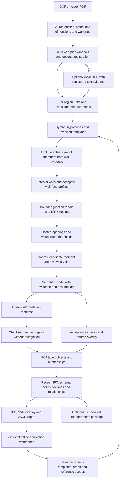

# Semantic reconstruction: implementation and review

This branch replaces whole-line pairing and long room-closing extensions with
source-linked interpretation, interval reconstruction, hosted openings and
independent footprint candidates. It is an implementation milestone, not an
accuracy certification for an arbitrary drawing. Generated IFCs are explicitly
drafts while source, symbol, dimension or topology checks remain unresolved.

## Implemented flow



CAD ingestion retains entity IDs, nested block transforms and attributes,
tessellated curves plus analytic metadata, hatch boundaries and holes, and
native dimension witness points, measurement axes and actual text midpoints.
Unsupported/conversion failures are reported.
PDF ingestion retains vector paths, cubic controls, fills and text; flattened
vectors receive a warning. Raster-only PDFs receive an explicit diagnostic.

Region proposals are spatial candidates, not recognized floor identities.
Only regions explicitly marked `kind: "plan"` are authored. Registration
subtracts a reviewed source-coordinate origin. Multiple models require explicit
elevations and unique region IDs; the code does not invent storey spacing.

Wall pairing works in each parallel family's coordinate frame at arbitrary
angles and consumes only overlapping intervals. Thin rectangles retain this
wall-segment representation; complex native filled boundaries, reviewed polygon
profiles, and explicitly configured exploded hatch cells can supply wall-face
profiles with holes. These are evidence-backed candidates, not automatic proof
of architectural classification. Junction repair for wall segments uses deterministic
nearest candidates, a 1-inch snap budget and a 6-inch extension budget; actual
movements and budgets are recorded. These are repair limits, not acceptance
tolerances. Later noding and room processing add no further drafting movement.
Collinear gaps are not automatically closed.

Wall profiles preserve their accepted boundary without automatic snapping or
buffer-based repair. IFC authoring maps a segment host to a profile only when
its entire wall footprint is covered by that profile. Covered segments are not
exported as duplicate walls; their openings attach to the profile's IFC wall.
Partially overlapping segment/profile geometry or overlapping profiles fail
export and require review. Profile-only walls do not independently supply the
segment host graph required by automatic opening localization and dimension
association.

Door/window spans must resolve to wall hosts. A supported doorway gap receives
a host whose IFC geometry is actually cut by an `IfcOpeningElement`. Doors and
windows fill those openings through IFC relationships. Room boundaries cross
ground-level doorway thresholds using virtual edges; windows with sills remain
physical room boundaries. An uncertain host is reported instead of guessed.

Rooms do not create floor slabs. Closed wall cells produce footprint candidates;
a reviewed exterior and holes establish the accepted footprint. Courtyards and
shafts supplied as voids are subtracted from both applicable floor and room
regions. IFC slabs extrude the footprint with its holes, independently of rooms.

## Run locally

Python 3.12+ and the declared project dependencies are required. Installation
may download packages; follow the workspace's permission instructions.

```bash
python -m archiagent --dxfFilePath drawing.dxf --inspect
python -m archiagent --dxfFilePath drawing.dxf --units-per-foot 12 --list-regions
python -m archiagent --dxfFilePath drawing.dxf --outputDir out/review-1 \
  --walls WALLS --units-per-foot 12 --regions-file regions.json \
  --measurements measurements.json --review-file review.json
```

`--walls` selects known wall layers without a provider. `--rules` offers offline
name-based classification when semantic layer names exist. It cannot establish
that all geometry on a generic layer is architectural. **LLM layer classification
remains the default** when neither bypass is supplied; DXF vision escalation
still follows the provider configuration and `--no_vision`. Layer classification
alone cannot recover an exploded drawing's symbol instances. Local OCR is a
separate, explicit option; it does not replace or disable provider calls.

`--units-per-foot` also calibrates vector PDFs. DXF header units are evidence,
not validation. Unitless DXFs still need this global flag for initial loading,
even when later region records supply their own scale.

Each output directory must be new for this input: existing IFC, report or
overlay files are not overwritten. The report includes source entities,
dimension checks, symbol evidence, endpoint adjustments, assumptions and issues.
The SVG shows source paths in grey, walls red, openings blue and symbols green.
`--workbench` additionally writes a self-contained `<input>.<index>.review.html`
for each plan; open it locally to select source IDs, label instances, draw
footprints/voids, and export annotations. It requires no server or CDN.

By default a validly authored draft may exit `0`; inspect its reported status.
Use `--require-accepted` to stop before IFC authoring when interpretation checks
fail. The evidence report and overlay are still written. Export validation
failure returns `1` even in draft mode; its IFC remains for diagnosis.

## Frozen interpretation and replay

Every reconstruction writes `<input>.interpretation.json`. `--freeze-only`
stops after writing this manifest, report, overlays and any requested workbench;
it performs no IFC authoring. Draft geometry, assumptions and unresolved issues
remain present. `--require-accepted` can make a freeze-only run return failure
while preserving those review artifacts.

```bash
python -m archiagent --dxfFilePath drawing.dxf --outputDir out/frozen \
  --rules --review-file review.json --freeze-only
python -m archiagent --dxfFilePath drawing.dxf --outputDir out/replayed \
  --replay-manifest out/frozen/drawing.interpretation.json --blender-package
python -m archiagent --print-interpretation-prompt
```

Use the drawing's required scale and region options on the initial run. Replay
requires exactly one input path and an output directory, verifies the source
SHA256 and manifest digest, and decodes only declared model dataclasses. It does
not parse CAD, perform OCR, classify symbols, or call a provider. It rejects
new interpretation settings including height, units, regions, page, reviews,
measurements, reference annotations, workbench and provider configuration.
`--freeze-only` cannot be combined with replay or a Blender package.

The manifest stores model geometry in registered feet, source identity,
construction decisions, assumptions, unresolved issues, input review data,
package versions, prompt hashes and an implementation-source hash. The `models`
records drive construction; the `decisions` records explain them. Changing a
decision means revising its review input and generating a new manifest, not
editing the explanatory record and expecting geometry to change. Integrity
hashes do not authenticate reviewers or establish approval. Reviewer assertions
remain distinct from pipeline decisions and independent accuracy measurements.

Replay preserves recorded warnings and reruns current model and export checks.
It writes a report and a copy of the manifest; it does not recreate source
overlays or workbenches because it does not re-extract the drawing. Version
differences are reported, not silently treated as equivalent software. Frozen
geometry supports reproducible construction; changed library versions, IFC
identifiers and serialization can still prevent byte-identical output.

The printed interpretation prompt is a reusable agent/review contract, not a
new automatic LLM stage. Layer-classifier prompts separately describe mixed
layers, nonorthogonal walls, structural hatch evidence and ambiguous swing
symbols. Their confidence values are uncalibrated evidence-strength scores.

## IFC-first Blender package

`--blender-package` runs only after successful reopened-IFC export checks. It
writes `<input>.blender/source.ifc`, `mesh_manifest.json` and a standalone
`build_blender.py`; it never launches a GUI, installs addons, or generates a
blend without an explicit Blender invocation.

```bash
blender --background --factory-startup --python-exit-code 1 \
  --python out/replayed/drawing.blender/build_blender.py -- \
  --manifest out/replayed/drawing.blender/mesh_manifest.json \
  --output out/replayed/drawing.blend --link-bonsai
```

Omit `--link-bonsai` if only editable mesh objects are required. The script
verifies the packaged IFC checksum, uses world-coordinate meshes in metres,
preserves per-face IFC colors/transparency, groups objects by spatial container,
and keeps IFC identity metadata. Missing physical leaf representations fail
mesh export; actual opening voids are not displayed as physical meshes.
Representation-free aggregate parents are explicitly recorded.

Blender construction creates a new scene and retains existing scenes. Optional
Bonsai linkage requires an installed addon and no already-loaded IFC project;
addon activation is confined to the process without saving user preferences.
A bounds-fitted orthographic camera and neutral lighting are included unless
`--no-presentation` is supplied. No cutaway duplicates or additional IFC
elements are generated. Existing blend files require explicit `--overwrite`.

Meshes remain individually editable triangles. Metadata alone is not a live BIM
link, and ordinary mesh edits do not automatically update `source.ifc`. Use
Bonsai's BIM editing/export workflow when linked; complete edit/export round-trip
behavior is not certified. Background Blender build and independent reopen have
been exercised on a synthetic IFC fixture, including saved links, source
coordinates, materials and preservation of existing scenes.

## Review input formats

Source windows and measurement endpoints use the drawing's original units.
Symbol positions, footprint rings and void rings use **model feet after
registration**. Elevations always use feet. Do not mix these coordinate systems.

Example `regions.json` for `--regions-file`:

```json
{
  "regions": [
    {"id": "ground", "kind": "plan", "name": "Ground floor",
     "bounds": [0, 0, 1200, 1800], "origin": [0, 0],
     "units_per_foot": 12, "elevation_ft": 0},
    {"id": "upper", "kind": "plan", "name": "Upper floor",
     "bounds": [1400, 0, 2600, 1800], "origin": [1400, 0],
     "units_per_foot": 12, "elevation_ft": 11}
  ]
}
```

Example `measurements.json`:

```json
{
  "measurements": [
    {"id": "review-width", "region_id": "ground",
     "start": [0, 0], "end": [120, 0], "expected_ft": 10,
     "basis": "centerline", "measurement_axis": [1, 0]},
    {"id": "review-depth", "region_id": "ground",
     "start": [0, 0], "end": [0, 240], "expected_ft": 20,
     "basis": "face"}
  ]
}
```

`basis` is `face` or `centerline`. Optional `measurement_axis` projects the
witness span along a finite nonzero direction (important for rotated dimensions
with offset witnesses). Otherwise straight endpoint distance is used. Physical
length must come from independently reviewed annotation/source evidence, not
from dividing model coordinates by the scale being tested. A reviewed record
with the same ID as a native dimension replaces that dimension's interpretation.

Default native numeric measurements without independent unit-bearing text
remain unverified. Acceptance requires at least two distinct associated spans
and every included dimension to match final reconstructed faces/axes within
2 inches (50.8 mm). Missing geometry, unmatched witnesses, inconsistent source
spans and unresolved dimensions fail the gate.

Example `review.json` (coordinates are illustrative, not a client annotation):

```json
{
  "symbols_verified": false,
  "footprint_verified": false,
  "templates": [
    {"id": "column-seed", "kind": "column", "subtype": "rectangular",
     "source_ids": ["CAD-HANDLE-1"], "tolerance_in": 0.1,
     "rotations_deg": [0, 90, 180, 270]}
  ],
  "footprints": [
    {"boundary": [[0,0], [10,0], [10,20], [0,20], [0,0]],
     "holes": [[[4,8], [6,8], [6,10], [4,10], [4,8]]]}
  ],
  "voids": []
}
```

Use the actual input's `source_sha256` at the root of a review document to bind
it to that file; a supplied mismatching hash is rejected. For multiple plans,
put review records under `"regions": {"ground": {...}, "upper": {...}}`.
Template `source_ids` identify reviewed seed geometry in that drawing. Matching
uses translation and listed rotations, bounded metric tolerance and actual
source paths; it does not rescale symbols or exclude everything in a box.
Seeds can label columns, windows, doors, stairs, beams, furniture and fixtures.

Vector matching is the default. A template can explicitly request
`"matcher": "raster"` to use optional OpenCV matching of rendered source paths:

```json
{"id": "fixture-seed", "kind": "plumbing", "matcher": "raster",
 "source_ids": ["CAD-HANDLE-2"], "rotations_deg": [0,90,180,270],
 "threshold": 0.95, "pixels_per_foot": 32, "tolerance_in": 0.1}
```

This remains a drawing-local seed matcher with bounded searches and source
membership checks. It does not provide pretrained symbol understanding or a
general image-input pipeline. Matches and excluded candidates retain evidence
for review. Neither matcher changes the source scale.

An optional `symbols` array replaces automatic hypotheses with explicit
`SymbolInstance` records. Required fields are `id`, `kind`, `position`,
`width_ft` and `depth_ft`; useful optional fields include `subtype`, `boundary`,
`rotation_rad`, `source_ids`, `height_ft`, `evidence`, `confidence` and
`properties` (a list of key/value pairs). Geometry exclusion uses only member
source IDs. Keep `symbols_verified` false until symbol classification **and
coverage** have been reviewed; an empty detector result is not evidence of an
empty drawing. Setting the flag records a reviewer assertion, not independent
machine proof of correctness.

Set `footprint_verified: false` for unaccepted footprint outlines. The polygons
can drive a draft slab while the footprint acceptance gate remains unresolved.
Workbench exports always set this flag false, even when an individual outline
has been marked reviewed. Supplying `footprints` without an explicit
`footprint_verified: true` no longer marks the exterior accepted, including
legacy review files. Set it true only after deliberate exterior-boundary review.
Reviewed void geometry alone does not establish an accepted exterior.

### Wall-face profiles and exploded hatching

Native complex wall fills and hatch boundaries on classified wall layers are
considered automatically when they satisfy thin-material evidence. The default
maximum thickness for this evidence filter is 24 inches; broad filled rooms
are rejected for review. Simple filled rectangles continue through the existing
segment detector. Invalid profiles are reported rather than silently repaired.

Use `wall_profiles` in a review record to replace automatic profile hypotheses
with accepted contours in registered **model feet**. This does not disable
segment reconstruction or opening localization:

```json
{
  "wall_profiles": [
    {
      "id": "reviewed-corner", "units": "ft",
      "boundary": [[0,0],[8,0],[8,0.5],[0.5,0.5],[0.5,6],[0,6],[0,0]],
      "holes": [], "source_ids": ["REVIEWED-SOURCE-ID"],
      "source_layer": "MASONRY", "review_status": "accepted_after_review"
    }
  ]
}
```

Rings must be finite, valid positive-area polygons. Allowed statuses are
`accepted_after_review` and `accepted_by_rule`; IDs must be unique. An explicit
empty `wall_profiles` list disables automatic profile hypotheses. As with other
review geometry, binding the review document to the source checksum is advised.

Exploded hatch inference is opt-in and requires **separate, explicitly selected**
boundary and hatch-stroke layers. Add this configuration to a review record
when those layer roles have been established:

```json
{
  "exploded_hatch_profiles": {
    "boundary_layers": ["MASONRY-EDGES"],
    "hatch_layers": ["MASONRY-POCHE"],
    "min_strokes": 3,
    "max_thickness_in": 24,
    "max_segments": 20000,
    "max_cells": 10000,
    "max_intersections": 100000
  }
}
```

The detector nodes and polygonizes selected boundaries, then requires distinct
interior hatch midpoint support and thin-material evidence. It does not snap
open boundaries, force right angles, infer same-layer stroke semantics, or merge
ambiguous cells into guessed walls. Segment, cell and intersection limits bound
work on dense drawings; exceeding a limit requires selecting a smaller region.
Explicit `wall_profiles` take precedence over this configuration. Automatically
accepted candidates still require source-overlay and semantic review.

## Offline annotation and scoped evaluation

```bash
python -m archiagent --dxfFilePath drawing.dxf --outputDir out/annotate-1 \
  --walls WALLS --units-per-foot 12 --regions-file one-plan.json --workbench
```

In the generated HTML, select actual source entities or draw an outline, choose
the class, and save the annotation. Source-ID lookup and viewport bounds help
isolate small areas in drawings with thousands of exploded strokes. Footprints
and voids require drawn polygon boundaries; a selection bounding box is not
silently used as an exterior. Enter reviewer identity/role before marking an
annotation reviewed. Work is held in browser memory until exported.

The two exports have different consumers:

- **Export annotations** writes `<region>.annotations.json` for
  `--reference-file`. Symbol observations and explicit complete bbox/class
  scopes support evaluation; footprint/void annotations retain separate
  provenance and are not counted as symbols.
- **Export model review** writes `<region>.model-review.json` for
  `--review-file`. It contains reviewed source templates and any footprint/void
  polygons. Symbol coverage and footprint acceptance remain false. It does not
  copy benchmark symbol records into the pipeline's `SymbolInstance` schema.

Both exports bind the source SHA256, region ID and original source-region
bounds. Annotation geometry uses registered **model feet**; retained origin and
source units per foot make that registration explicit. Missing registration in
legacy reports disables export unless bounds/origin are explicitly supplied to
the Python workbench writer; overrides remain labelled unverified.

To score the same selected plan against exported reference annotations:

```bash
python -m archiagent --dxfFilePath drawing.dxf --outputDir out/evaluate-1 \
  --walls WALLS --units-per-foot 12 --regions-file one-plan.json \
  --reference-file ground.annotations.json
```

`--reference-file` accepts one selected plan per invocation and writes results
into the report. Reference records use `annotation_status: "partial"` by
default, individual `status: "draft"` or `"reviewed"`, and attributed reviewer
roles. Precision/recall are reported only inside explicitly complete, reviewed
scope rectangles for named symbol classes. Unannotated areas are not treated as
negative examples; without complete scopes the result is diagnostic matching
only. Assistant annotations remain attributed to the assistant. Scores never
set model acceptance flags, and automatic wall-coverage scoring is not available.

## Optional local OCR

Install the optional `cv` extra only when these features are needed and package
downloads are authorized:

```bash
python -m pip install -e ".[cv]"
```

`--ocr` explicitly renders selected vector paths, runs the installed macOS
Vision text recognizer through the local Swift toolchain, and attaches OCR
labels with confidence and pixel-to-source registration. It writes rendered
images, tile results and mapping metadata beside the run's evidence. macOS and
an available Swift toolchain are required; no alternate engine or weights are
downloaded automatically. OpenCV supplies rendering and image operations via
the `cv` extra. To combine local OCR with provider-free classification:

```bash
python -m archiagent --dxfFilePath drawing.dxf --outputDir out/ocr-1 \
  --walls WALLS --units-per-foot 12 --regions-file one-plan.json --ocr --workbench
```

OCR is off unless requested. Its text remains unreviewed evidence. A native
dimension can receive an OCR association only near its retained text midpoint,
with one unambiguous full unit-bearing label and confidence at least 0.85.
The default association radius is 6 inches, capped at 12; split labels are not
concatenated, unitless numbers are not guessed, and a label cannot qualify two
dimensions. These checks bound association errors but do not establish that OCR
characters or the dimension's meaning are correct. Review the label and its
witness geometry before treating it as a physical reference.

## Acceptance and remaining work

Separate gates cover dimensions/scale, symbol review, hosted openings,
unresolved junctions, and footprint review. IFC export is independently reopened
for IFC4 schema/EXPRESS checks, counts, provenance, containment, void/fill
relationships, positive finite solid volumes and world bounds. Volumes are
compared with the semantic model, including wall opening cuts and slab holes.
These checks establish export fidelity; they cannot validate the interpretation
against an unannotated drawing.

Remaining limitations are material:

- Automatic interpretation of legends, schedules, outlined text, sliding-door
  variants, glazing, structural columns and arbitrary exploded fixtures is not
  complete. Exploded swing detection and reviewed templates are bounded evidence
  paths, not a trained universal symbol recognizer.
- A general image/raster-PDF reconstruction pipeline and DWG conversion remain
  unimplemented. Optional local OCR and raster template matching operate on
  registered vector-source renders; they do not remove these input limitations.
  No code or weights from DeepFloor/deep-floor-plan-recognition or
  FloorplanToBlender3d have been adopted.
- Complex polygon wall profiles, including holes and nonorthogonal corners,
  are exported as swept IFC walls. Analytic curved-wall reconstruction and
  automatic separation of hatch/faces sharing one mixed layer remain incomplete.
  Automatic opening-host and final-dimension checks still depend on the wall
  segment graph; arbitrary profile-only models require additional review.
- Storey classification and alignment are reviewed inputs. Registration supports
  translation, not automatically solved rotation, grids or column alignment.
- IFC joints connect separate wall sweeps; overlapping solids at L/T/X joints
  are reported and are not yet trimmed into disjoint quantities.
- Door/window infills are simplified rectangular solids. Wall/column heights,
  opening heads/sills and 0.5-foot slab thickness remain explicit assumptions.
- Furniture and MEP symbols can exclude non-wall evidence; recognizing them does
  not construct furniture assets, wiring routes or plumbing systems.
- Frozen replay preserves accepted inputs and draft assumptions; it does not
  improve an incorrect interpretation. No independent cross-project recognition
  accuracy gain or runtime speedup is claimed from these changes alone.

Regression checks are in `checks/` and cover generated DXF/PDF evidence,
geometry, regions, measurements, symbols, CLI acceptance and actual IFC solids:

```bash
mkdir -p .test-tmp
TMPDIR="$PWD/.test-tmp" python -m pytest checks --basetemp=.test-tmp/checks
```

Client-derived IFC/report/overlay outputs and temporary test artifacts are
ignored by Git. Generated-fixture coverage, source annotation tools and scoped
scores do not establish that the supplied client floor plan meets the agreed
50.8 mm, symbol, topology or footprint acceptance targets.
