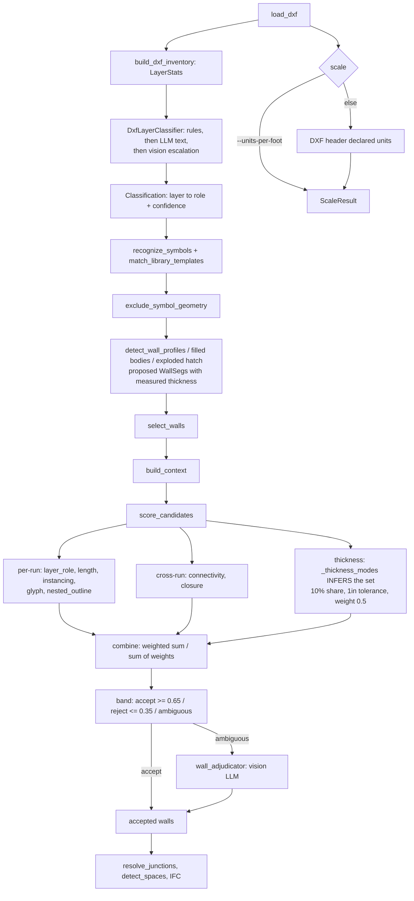
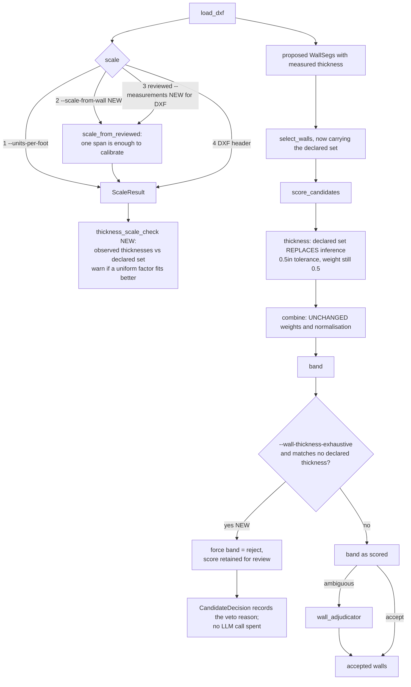

# Declared wall metrics: known thicknesses and a true wall length

Date: 2026-10-06
Status: design, pending implementation
Related: `2026-09-18-geometry-first-wall-candidacy-design.md`, `2026-09-24-symbol-library-design.md`

## Problem

Two facts a human reads off a drawing in seconds are currently unavailable to
the pipeline, which instead guesses both:

1. **The wall thickness set.** The drafter knows every wall is 4in or 8in. The
   code infers the set from the drawing and can infer it wrongly.
2. **The real length of a wall.** For DXF there is no way to supply one. Scale
   comes only from `--units-per-foot` or the file header — and the header is
   known wrong on two corpus files.

Both are ground truth the user already has. Neither is accepted today.

## Evidence from the current code

### Thickness is inferred, with three failure modes

`candidacy._thickness_modes` ([candidacy.py:216](../../../archiagent/geometry/candidacy.py#L216))
counts run length per rounded thickness and keeps any thickness carrying
`MODE_SHARE` (10%) or more of total length. `candidacy._thickness`
([candidacy.py:227](../../../archiagent/geometry/candidacy.py#L227)) then scores
a candidate `+1.0` if within `MODE_TOLERANCE_FT` (1 inch) of a mode, `-0.5`
otherwise, and `0.0` when no modes were found.

- **No signal.** Where real walls are a minority of the geometry, true
  thicknesses never reach 10% share, so `modes` is empty and the signal is inert.
- **Inverted signal.** Where non-wall parallel pairs dominate — dimension
  witness lines, hatch bands at consistent spacing — a false thickness becomes a
  mode. Junk scores `+1.0`, real walls score `-0.5`. Worse than no signal.
- **Circular.** Modes are counted only over runs whose layer role is a wall role
  at or above `WALL_CONFIDENCE_FLOOR`. The corpus survey found roughly 73% of
  block instances carry meaningless names, so a mis-scored layer propagates
  straight into the mode set.

The 1-inch tolerance also makes 4in and 8in classes nearly touch: 4in accepts
3–5in, 8in accepts 7–9in.

### For DXF there is no measurement-to-scale path at all

`infer_associated_scale` ([verify.py:215](../../../archiagent/scale/verify.py#L215))
is called from exactly one place, `extract_from_primitives`
([pipeline.py:215](../../../archiagent/pipeline.py#L215)) — the **PDF** path.
`extract_from_dxf` never calls it. DXF scale is `--units-per-foot`, else the
header, chosen in [cli.py:804](../../../archiagent/cli.py#L804).

So `--measurements` on a DXF run feeds *verification* only
(`verify_dimensions`), never calibration. And `infer_associated_scale` refuses a
single span outright (`if len(unique) < 2: return None`), so even on the PDF
path one reviewed length is silently ignored.

This corrects an earlier assumption that a true wall length merely duplicates
`--units-per-foot`. For DXF it is new capability.

## Goals

1. Accept a declared wall thickness set and use it in place of the inferred one.
2. Optionally treat that set as exhaustive, vetoing candidates matching nothing.
3. Accept a true wall length on the CLI and let it set scale for DXF.
4. Cross-check the two against each other to catch a wrong scale.
5. Scope a GUI for picking the wall length, for later implementation.

## Non-goals

- Re-tuning `ACCEPT_FLOOR` / `REJECT_CEILING` / `WEIGHTS`. See the decision below.
- Changing `infer_associated_scale` or the PDF scale path.
- Per-layer or per-storey thickness sets. One set per run until a drawing needs more.
- Implementing the GUI. Scoped here, built later.

## 1. CLI surface

```
--wall-thickness IN [IN ...]        declared wall thicknesses in inches, e.g. --wall-thickness 4 8
--wall-thickness-exhaustive         the list is complete: veto runs matching none of it
--wall-thickness-tolerance-in X     match tolerance, default 0.5
--scale-from-wall X1 Y1 X2 Y2 LEN   two source-coordinate points on one wall and its true
                                    length; repeatable. LEN accepts 10, 10ft, 3.05m, 3050mm,
                                    120in or 10'-6"
```

`LEN` is parsed by the existing `parse_explicit_length`
([verify.py:70](../../../archiagent/scale/verify.py#L70)), which already handles
`mm/cm/m/ft/in` and feet-inch strings — no new parser.

Precedence for scale, highest first: `--units-per-foot`, then
`--scale-from-wall`, then a reviewed `--measurements` file, then the DXF header.
An explicit `--units-per-foot` always wins so existing invocations are unchanged.

## 2. Declared thicknesses in candidacy

`Context` ([candidacy.py:37](../../../archiagent/geometry/candidacy.py#L37))
gains three fields, defaulted so every existing caller is unaffected:

```python
declared_thickness_ft: tuple[float, ...] = ()
thickness_tolerance_ft: float = MODE_TOLERANCE_FT
thickness_exhaustive: bool = False
```

`build_context` and `select_walls` gain matching keyword arguments, threaded
from `_assemble` and the CLI.

`_thickness_modes` returns the declared set when one is present, and infers as
today when it is not:

```python
def _thickness_modes(walls, ctx):
    if ctx.declared_thickness_ft:
        return ctx.declared_thickness_ft
    ...existing inference unchanged...
```

`_thickness` uses `ctx.thickness_tolerance_ft` instead of the module constant,
so a declared set gets the tighter default (0.5in) while inference keeps 1in.

### Decision: the veto is a band override, not a weight change

The tempting change is to raise `WEIGHTS["thickness"]` from `0.5`, the lowest
weight in the table, since ground truth deserves more than a guess. **We do not
do this.** `combine` divides by `sum(WEIGHTS.values())`
([candidacy.py:158](../../../archiagent/geometry/candidacy.py#L158)), so
changing any one weight rescales every score, and `ACCEPT_FLOOR` (0.65) and
`REJECT_CEILING` (0.35) were tuned against the current normalisation. Raising
one weight silently re-bands every candidate in every drawing, including ones
this feature is not meant to touch.

Instead, with `--wall-thickness-exhaustive`, a candidate matching no declared
thickness has its band forced to `reject` **after** scoring:

```python
vetoed = ctx.thickness_exhaustive and modes and not _matches_declared(w, ctx)
out.append(ScoredCandidate(candidate_id(w), w, signals, score,
                           "reject" if vetoed else band(score)))
```

The score is still recorded unchanged, so a review can see what the geometry
thought before the veto applied. Weighted-sum behaviour is untouched.

Without `--wall-thickness-exhaustive`, the declared set only replaces the
inferred modes — same `+1.0 / -0.5` signal, same weight, tighter tolerance.

### What the declared set does and does not change about layer scope

A common expectation is that declaring thicknesses is what makes the tool search
**all** layers for parallel lines a wall-thickness apart, instead of only
`WALL`-named ones. It already does that, and has since geometry-first candidacy:
`candidate_layers` ([layers.py:93](../../../archiagent/classify/layers.py#L93))
returns every layer **except** those confidently classified into a never-wall
role. Layer names gate almost nothing.

One exception worth knowing: filled-body detection (`detect_wall_profiles`,
[profiles.py:103](../../../archiagent/geometry/profiles.py#L103)) **is** still
restricted to classified wall layers, because a filled closed shape on an
arbitrary layer is far more often furniture than wall. Parallel-line pairing is
unrestricted; hatch/solid body detection is not.

So the declared set does not widen the search. It sharpens the **decision** over
an already-wide search — which is the half that was guessing.

### The GUI for thicknesses

Thicknesses are picked in the same screen as the scale, not typed as a flag.

- The tool proposes the thickness classes it observed, each with the number of
  runs supporting it — the same evidence `_thickness_modes` already computes,
  shown rather than used silently. A reviewer sees `9" (142 runs)`, `4½" (38)`,
  `2" (6)` and ticks the real ones.
- **Defaults are pre-filled and the user may simply continue.** Proposals above
  the existing `MODE_SHARE` are pre-ticked; the rest are offered unticked.
- **Units are selectable, defaulting to inches.** The value is converted once,
  on entry, and carried in feet from then on.
- A free-text row adds a thickness the tool did not observe, for a wall class
  that exists in the building but was drawn too rarely to form a mode.
- The exhaustive veto is a checkbox on this panel, worded as the consequence
  rather than the mechanism: *"These are the only wall thicknesses in this
  drawing — reject anything else."* It is unticked by default, and ticking it
  shows how many runs would be rejected before the run starts.

### Why the veto is the valuable part

A vetoed candidate never reaches the vision adjudicator, which only sees
`ambiguous` candidates ([candidacy.py:330](../../../archiagent/geometry/candidacy.py#L330)).
Parallel non-wall pairs at wall-ish spacing are the dominant false-positive
class in this corpus; vetoing them by declared thickness removes them before
they cost an LLM call, and removes them deterministically.

## 3. Scale from a wall length

> **Superseded by `2026-10-06-scale-resolution-design.md`.** That spec keeps
> `scale_from_reviewed` exactly as described below, and builds the full
> resolution ladder around it: the drawing's own extracted dimensions as the
> default source, one mandatory asserted length with a second invited rather
> than required, a user assertion overriding the extractor on disagreement, and
> the picker as the primary input route. Read that spec for the scale story;
> this section remains because `scale_from_reviewed` is still the building block
> and its contract has not changed.

New function in `scale/verify.py`, leaving `infer_associated_scale` alone:

```python
def scale_from_reviewed(measurements, tolerance_in=2.0) -> float | None:
    """Source units per foot from human-asserted lengths; one span is enough."""
```

- Considers only measurements whose `source` is `reviewed-measurement` or
  `cli-wall-length`, i.e. human assertions — never native dimension text or OCR.
- Returns the median of `span / expected_ft`.
- With two or more distinct spans, disagreement beyond `tolerance_in` raises,
  exactly as `infer_associated_scale` does.
- With exactly one span, returns the scale. One assertion calibrates.

A single span calibrates but **cannot** verify: `scale_verified` requires at
least two distinct verified spans
([pipeline.py:166](../../../archiagent/pipeline.py#L166)), and that rule is
unchanged. One `--scale-from-wall` therefore yields a correctly scaled model
that still reports `scale_unverified`. Two or three make it verifiable. The CLI
says so when exactly one is supplied.

`--scale-from-wall` values are turned into `Measurement` records with
`source="cli-wall-length"`, which also makes them visible to
`verify_dimensions` like any other reviewed measurement.

## 4. Thickness-versus-scale cross-check

Given a declared set, the observed run thicknesses are a free check on scale.
If declared thicknesses are 4in and 8in but observed runs cluster at 3.4in and
6.8in, every observation is off by the same factor and the scale is wrong.

New function in `geometry/candidacy.py`:

```python
def thickness_scale_check(walls, declared_ft, tolerance_ft) -> tuple[float, float] | None:
    """Return (implied_correction, share_explained) when a single uniform
    factor aligns observed thicknesses to the declared set far better than 1.0."""
```

Emitted as a `warn` Issue `declared_thickness_scale_mismatch` naming the implied
correction factor. It never changes the scale by itself — a silent automatic
rescale is exactly the kind of invisible decision this codebase avoids. It tells
the user their `--units-per-foot` is probably wrong by that factor.

This would have caught the known `PLAN.dxf` / `Floor Plan.dxf` units problem
automatically.

## 5. Flow

### Current classification and wall selection



### After this change



Everything not drawn is unchanged: layer classification, symbol recognition,
geometry exclusion, junction resolution, space detection and IFC authoring are
not touched by this spec.

## 6. GUI for picking the wall length — scoped, not built

> **Superseded by `2026-10-06-scale-resolution-design.md` §5**, where the picker
> is promoted from a later convenience to the primary way a scale assertion is
> supplied, and gains a second-span invitation that shows the implied scale
> against the tool's own extracted estimate as the length is typed. The analysis
> below — that `review_workbench.py` already provides the viewer and that the
> real work is a source-coordinate payload — is carried over unchanged.

The user is far better placed to give a true length by drawing a line along a
wall than by typing coordinates. **A new DXF viewer is not needed.**
`review_workbench.py` ([review_workbench.py](../../../archiagent/review_workbench.py))
already is a self-contained offline HTML plan viewer with no CDN or web service,
and it already has every primitive this needs:

| Needed | Already present |
|---|---|
| render the drawing | SVG `#source` group of clickable source shapes |
| pan and zoom | `changeView`, `view_bounds_ft`, fit-to-bounds button |
| click points on the plan | the `trace` outline tool collects clicked corners |
| coordinate readout | `#position` live coordinate display |
| export JSON | `download()` plus the existing export buttons |
| reviewer attribution | reviewer field with draft/reviewed status |

So the work is a **new mode in the existing workbench**, not a new application:

1. A `Measure` tool that collects exactly **two** clicks instead of a polygon.
2. A length field plus a unit select (`mm`, `cm`, `m`, `ft`, `in`, or a
   feet-inch string), validated by the same grammar `parse_explicit_length` accepts.
3. Export to `{"measurements": [{"id", "start", "end", "expected_ft"}]}`, which
   `load_measurements` already reads
   ([verify.py:170](../../../archiagent/scale/verify.py#L170)) — so the GUI's
   output feeds `--measurements` with no new file format.

### The one real obstacle, to solve when this is built

`load_measurements` documents its input as **source coordinates, before
registration**. The current workbench renders and exports **region-local model
feet**, and is generated from a completed `BuildingModel`
(`write_workbench`/`write_workbench_from_report`). Measuring *to establish*
scale happens before any of that exists.

So the measure mode needs a payload built directly from the `PrimitiveSet` in
raw source units — a `write_measure_workbench(ps, output_path)` alongside the
existing entry points — not a reuse of the model-derived payload. The SVG
drawing, interaction and export code is shared; only the payload source and the
coordinate space differ. This is the part to budget for; the rest is a tool mode.

A `--measure-workbench` flag would write it, by analogy with `--workbench`.

## 7. Error handling

| Condition | Result |
|---|---|
| `--wall-thickness` with a non-positive or non-finite value | configuration error, exit |
| `--wall-thickness-exhaustive` without `--wall-thickness` | configuration error, exit — a complete list of nothing would veto every wall |
| `--wall-thickness-tolerance-in` <= 0 or >= smallest gap between declared thicknesses / 2 | configuration error, exit, naming the overlap |
| `--scale-from-wall` length unparseable | configuration error, exit, listing accepted forms |
| `--scale-from-wall` two coincident points | configuration error, exit |
| two or more `--scale-from-wall` disagreeing beyond 2in | error, exit, naming both implied scales |
| exactly one `--scale-from-wall` | proceeds; notice that scale cannot be verified from one span |
| declared thicknesses align better under a uniform factor | `warn` Issue, run continues |
| both `--units-per-foot` and `--scale-from-wall` given | `--units-per-foot` wins, `info` Issue recording that the supplied length was not used for scale |

## 8. Testing

- declared set replaces inferred modes: a drawing whose inferred mode would be
  wrong (junk pairs dominating) still scores real walls `+1.0`
- the inverted-signal case: with junk at 6in dominating and walls at 4in/8in,
  the declared set flips which runs are penalised
- tolerance: 4.4in matches a declared 4in at 0.5in tolerance; 4.6in does not
- overlapping tolerance is refused: declared `4 5` with tolerance 1.0 exits
- veto: with `--wall-thickness-exhaustive`, a 6in run bands `reject` even when
  its score is above `ACCEPT_FLOOR`, and its score is still recorded
- without `--wall-thickness-exhaustive`, that same run keeps its scored band
- weights and normalisation unchanged: `combine` over a fixed signal tuple
  returns the identical value before and after this change
- vetoed candidates are not sent to the adjudicator
- `scale_from_reviewed` with one span returns `span / expected_ft`
- `scale_from_reviewed` with one span leaves `scale_verified` false
- `scale_from_reviewed` ignores native-dimension and OCR sources
- two disagreeing reviewed spans raise
- `infer_associated_scale` behaviour is byte-identical (regression pin for the PDF path)
- `--scale-from-wall` on a DXF whose header units are wrong produces a correctly
  scaled model, using `PLAN.dxf`-shaped synthetic geometry rather than client data
- `thickness_scale_check` finds a 12x factor on a drawing authored in inches but
  declared in feet, and returns `None` when thicknesses already match

## 9. Risks

- **An incomplete thickness list silently deletes walls.** This is the main one.
  `--wall-thickness-exhaustive` is opt-in precisely because parapets, kerbs,
  cladding and stud partitions routinely differ from the main set. Mitigation:
  the veto is recorded per candidate with its pre-veto score, so a review can
  see exactly what was removed and why, and the count of vetoed runs is reported.
- **Tolerance too tight for hand drafting.** Measured thickness comes from
  parallel-pair offsets, which carry drafting and tessellation error. 0.5in is a
  starting value; the overlap check stops a tolerance that merges adjacent classes.
- **Declared thicknesses are in inches, geometry in feet.** A unit slip here
  would be invisible and catastrophic. Conversion happens once, at the CLI
  boundary, and `Context` stores feet only — named `declared_thickness_ft` so a
  misuse reads wrong.
- **One length is not verification.** A user may read "scale came from my
  measurement" as "scale is confirmed". The one-span notice exists to prevent that.
